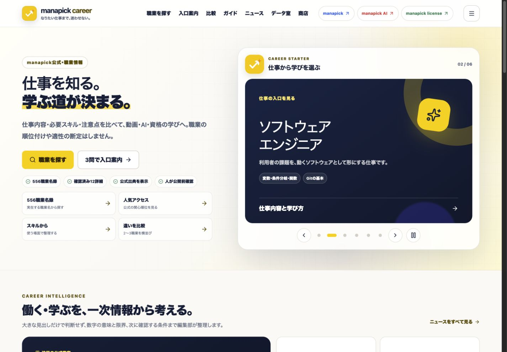
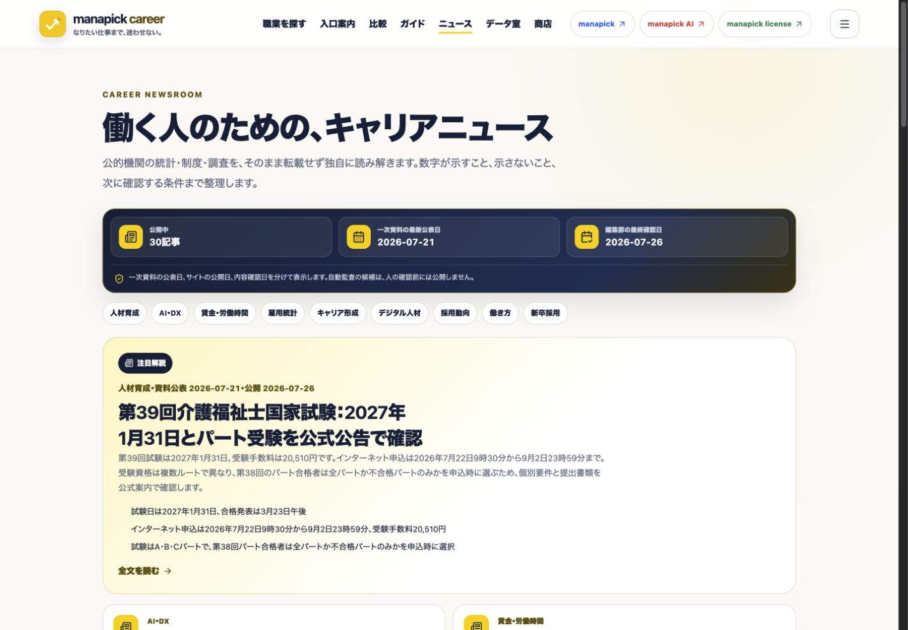
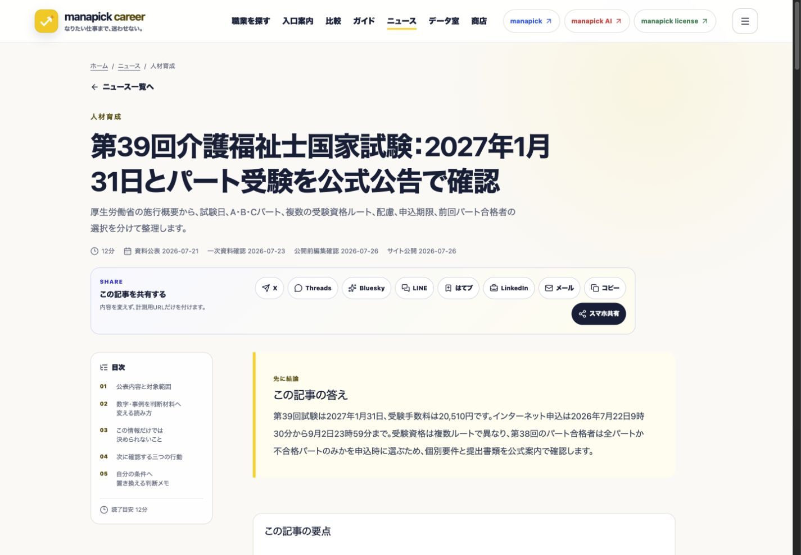
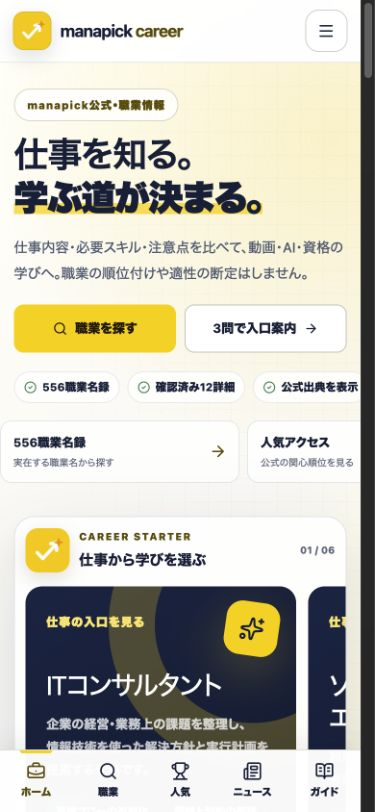
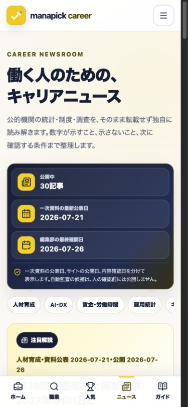
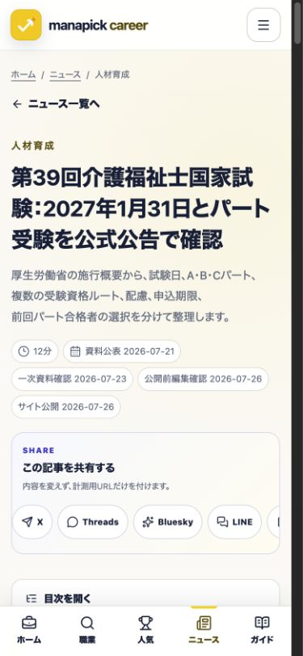
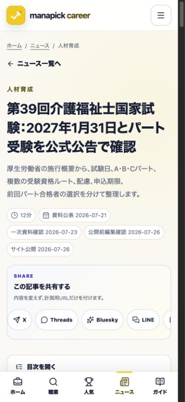

# career.manapick.app SEO・UX監査 2026-08-02

対象: 公開トップ、ニュース一覧、代表ニュース記事、スマホ表示、検索・公開ゲート

証跡スクリーンショット: `docs/screenshots/seo-audit-2026-08-02/`

## 1. トップ画面（デスクトップ）— healthy

- ヘッダー、主目的、職業検索、姉妹サイト連携が同一視野で理解できる。
- goldとnavyのコントラスト、カード境界、CTA階層は既存デザイン体系と一致する。
- document横あふれは検出されなかった。
- 今後はSearch Consoleの実クエリが発生してから、見出し・説明をクエリ単位で調整する。推測だけでタイトルを頻繁に変更しない。

## 2. ニュース一覧（デスクトップ）— healthy

- 30公開記事のうち最新の一次資料を主役にし、2列カードで一覧性を確保している。
- 公開日、分類、要約がリンク前に読める。公開ゲートによりdraftは0件露出。
- 2026年7月31日の新しい一次資料は2026年8月2日にdraft候補として追加。人のレビュー前には公開しない。

## 3. ニュース記事（デスクトップ）— healthy

- 結論、目次、要点、読み方、断定できないこと、次の行動、出典を順に読める。
- NewsArticleは可視本文のタイトル・日付・画像・著者と一致する範囲だけを出力する。
- 共有導線と関連職業・姉妹サイト導線は本文の文脈にある場合だけ表示する。

## 4. トップ画面（390px）— healthy

- 主要CTA、横スクロール、ハンバーガー、職業検索はタップ可能な寸法を保つ。
- 水平カルーセルはその領域だけに限定し、document全体の横あふれはない。
- 情報量は多いが、最初の画面で主CTAとサイトの非保証方針が確認できる。

## 5. ニュース一覧（390px）— healthy

- 分類チップは横スクロール、記事カードは1列になり、検索結果と記事一覧を混同しない。
- 見出し・要約・日付の順序が一貫している。

## 6. ニュース記事（390px）— fixed

修正前の比較証跡は `06-news-article-mobile.png` に保存した。

- 修正前は長い日本語H1が4行になり、導入文・日付との密度が高かった。
- H1だけを`clamp(1.62rem, 7.2vw, 2.05rem)`へ調整し、ページ一覧見出しのサイズとは分離した。
- メタ情報を28px以上のチップへ整理し、公開日・最終確認日を読み分けやすくした。
- 修正後も本文は0.92rem、行間1.95を維持し、長文を詰め込まない。

## 7. インデックスと鮮度 — needs external verification

- コード側のrobots、sitemap、canonical、内部リンク、draft除外は整合する。
- Search Consoleの未登録600 URLの内訳は添付HTMLにないため、原因は確定できない。
- 2026年7月31日公表の一次資料を検知しdraft化した。公開に必要な人の全主張レビューは未実施。
- Googleの再クロール日、Google選択canonical、インデックス登録は管理画面で未確認であり、成功扱いにしない。

## 完了条件

- lint、content、editorial、source、similarity、indexability、internal link、buildが成功。
- 375/390/768/1024/1280/1440/1920pxでdocument横あふれ0。
- ブラウザconsole error、hydration error 0。
- 公開ページ、sitemap、RSS、llms.txt、JSON-LD、公開OGにdraft 0。
- 本番HTTP 200、自己canonical、セキュリティヘッダーを再確認。

## 実ブラウザ再検証

- ローカル本番相当静的出力の代表ニュース記事を375/390/768/1024/1280/1440/1920pxで再計測し、全幅で`documentElement.scrollWidth <= clientWidth`を確認した。
- 代表ニュース記事に手動レスポンシブ広告要素2件、表示本文と対応するJSON-LD 2件があり、画面幅変更後もdocument全体の横あふれは0だった。
- 390pxのハンバーガーメニューは開閉でき、開いている間だけ本文スクロールを止める。職業、入口案内、比較、人気、スキル、ガイド、ニュース、データ室、商店、用語集、編集方針、FAQと3姉妹サイトへ通常リンクで移動できる。
- ブラウザのconsole/runtimeログは0件。主要UIのDOMスナップショットでもhydration error文言、欠落した見出し、空リンクを検出しなかった。

## 本番反映後の再検証

- Cloudflare Pagesのmainデプロイ成功後、`https://career.manapick.app/news/care-worker-exam-39/`を実ブラウザで再確認した。
- 自己canonical、記事見出し、手動広告要素2件、表示本文と対応するJSON-LD 2件を確認した。
- 実測viewportでは`clientWidth=375`、`scrollWidth=375`で横あふれ0、console/runtimeのwarning・error 0だった。
- 下書き`labor-force-june-2026`への公開リンクは存在しない。公開承認前の候補を本番導線へ混入させていない。

検索流入は外部結果であり、監査を「100点」や流入増加の保証には使わない。公開後のSearch ConsoleとGA4の実測で評価する。
